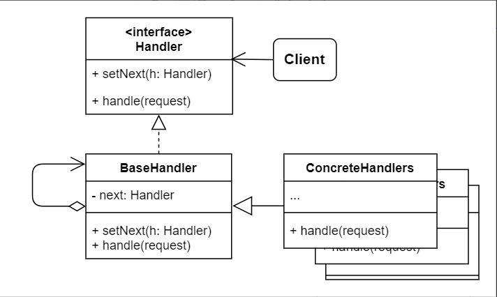

# No.13 Chain of Responsibility (Chain of Command)
Lets you pass requests along a chain of handlers. Upon receiving a request, each handler decides either to process or pass to the next.

## Structure
The structure of CoR consists of 4 parts:
1. Handler
  Declares the interface for all concrete handlers. It usually contains just a single method for handling requests. Sometimes may also have another method for setting the next handler.
2. Base Handler
  Optinal class where you can put your boilerplate code that's common to all handler classes.
3. Concrete Handlers
  Contain the actual code for processing request. Upon receiving a request, each handler must decide whether to process it or pass it along the chain.
4. Client
  Compose chains just once or compose them dynamically.

## When to Use
- When your program is expected to process different kinds of requests in various ways, but the exact types of requests and their sequences are unkown beforehand.
- Execute several handlers in a particular order.
- When the set of handlers and their order are supposed to change at runtime.

