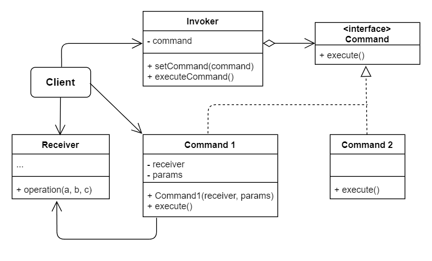

# No.14 Command (Action, Transaction)
Turns a request into a stand-alone object that contains all information about the request.

## Structure
The structure of Command consists of 5 parts:
1. Sender (invoker)
  Responsible for initiating requests. This class must have a field for storing a reference to a command object. Not responsible for creating the command object, usually get from the client.
2. Command
  Interface, declares just a single method for executing the command.
3. Concrete Command
  Implement various kinds of requests. Isn't supposed to perform the work on its own, but rather to pass the call to one of the business logic onjects.
4. Receiver
  Contains some business logic. Most commands only handle the details of how a request is passed to the receiver, while the receiver itself does the actual work.
5. Client
  Creates and configures concrete command objects. The client must pass all of the request parameters, including a receiver instance, into the command's constructor.

## When to Use
