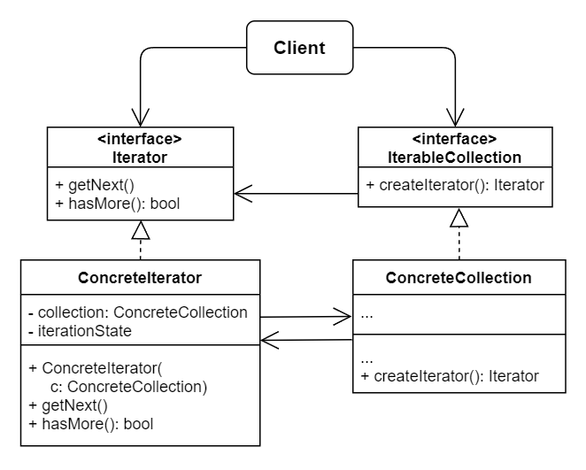

# No.15 Iterator
Lets you traverse elements of a collection without exposing its underlying representation.

## Structure
The structure of Iterator consists of 5 parts:
1. Iterator (interface)
  Declares the operations required for traversing a collection.
2. Concrete Iterator
  Implement specific algorithms for traversing a collection. Several iterators should be independently of each other.
3. Collection (interface)
  Declares one or multiple methods for getting iterators compatible with the collection. Return type is Iterator, not concrete ones.
4. Concrete Collections
  Return new instances of a particular concrete iterator class each time the client requests one.
5. Client
  Works with both collections and iterators via their interfaces. Typically, clients get iterators from collections instead of creating on their own.

## When to Use
- 
