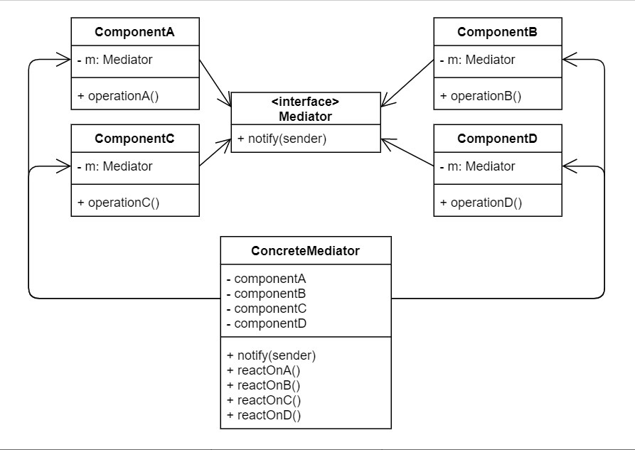

# No.16 Mediator (Intermediary, Controller)
Lets you reduce chaotic dependencies between objects. Restricts direct communications between the objects and forces them to collaborate only via a mediator object.

## Structure
The structure of Mediator consists of 3 parts:
1. Components
  Various classes that contain some business logic. Each component has a reference to a mediator, declared with the type of the mediator interface. 
2. Mediator (interface)
  Declares method of communication with components, which usually include just a single notification method. 
3. Concrete Mediators
  Encapsulate relations between various components. Concrete mediators often keep references to all components they manage and sometimes even manage their lifecycle.
- Components must not be aware of other components. If something important happens within or to a component, it must only notify the mediator.

## When to Use
- When it's hard to change some of the classes because they are tightly coupled to a bunch of other classes.
- When you can't reuse a component in a different program because it's too dependent on other components.
- Individual components become unaware of the other components.

## Pros and Cons
Pros
- Single Responsibility Principle.
- Open /Closed Principle.
- Reduce coupling between various components of a program.
- Reuse individual components more easily.
Cons
- Over time a mediator can evolve into a God Object.

## Relations with Other Patterns
- Mediator and Observer are quite similar. Just remember the primary goal of Mediator is to eliminate mutual dependencies among a set of system components. Instead they become dependent on a single mediator object. The goal of Observer is to establish dynamic one-way connections between objects, where some objects act as subordinates of others.