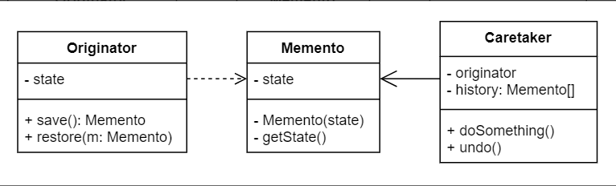

# No.17 Memento (snapshot)
Lets you save and restore the previous state of an object without revealing the details of its implementation.

## Structure
The structure of Memento consists of 3 / 4 parts:

**Nested Classes Implementation:**
1. Originator
  Produce snapshots of its own state, as well as restore its state from snapshots when needed.
2. Memento
  A value object that acts as a snapshot of the originator's state. It's a common practice to make the memento immutable and pass it the data only once, via the constructor.
3. Caretaker
  Knows only "when" and "why" to capture the originator's state, but also when the state should be restored. Can keep track of the originator's history by storing a stack of mementos.
- In this implementation, the memento class is nested inside the originator. The originator access the fields and methods of memento. Caretaker has very limited access to that, which lets it store mementos in a stack but not tamper with their states.

**Intermediate Interface Implementaion:**
1. 
