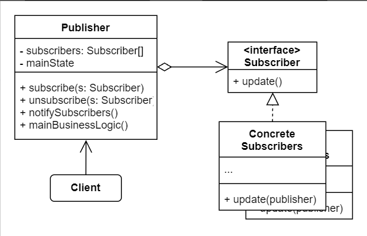

# No.18 Observer (Event-Subscriber, Listener)
Lets you define a subscription mechanism to notify multiple objects about any events that happen to the object they're observing.

## Structure
The structure of Observer consists of 4 parts:
1. Publisher
  Issues events of interest to other objects.
2. Subscriber (interface)
  Declares the notification interface. In most cases, it consists of a single update method.
3. Concrete Subscribers
  Perform some actions in response to notifications issued by the publisher.
4. Client
  Creates publisher and subscriber objects separately and then registers subscribers for publisher updates.

## When to Use
- When changes to the state of one object may require changing other objects, and the actual set of objects is unknown beforehand or changes dynamically.
- When some objects in your app must observe others, but only for a limited time or in specific cases.

## Pros and Cons
Pros
- Open / Closed Principle.
- Establish relations between objects at runtime.
Cons
- Subscribers are notified in random order.
