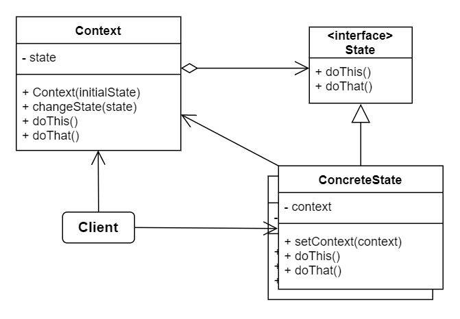

# No.19 State
Lets an object alter its behavior when its internal state changes. It appears as if the object changed its class.

## Structure
The structure of State consists of 4 parts:
1. Context
  Stores a reference to one of the concrete state objects and delegates to it all state-specific work. Communicate with the state objects via the state interface.
2. State
  Declares the state-specific methods.
3. Concrete States
  Provide their own implementations for the state-specific methods.
4. Client
  Interact with both Context and Concrete States, they can set the next state of the Context and perform the actual state transition by replacing the state object linked to the context.

## When to Use
- Object behaves differently depending on its current state, the number of states is enormous, and the state-specific code changes frequently.
- Compose hierarchies of state classes and reduce duplication by extracting common code into abstract base classes.

## Pros and Cons
Pros
- Single Responsibility Principle.
- Open / Closed Principle.
- Simplify the code of the context by eliminating bulky state machine conditions.
Cons
- Can be overkill if a state machine has only a few states or rarely changes.

## Relations with Other Patterns
- State can be considered as an extension of Strategy. Both patterns are based on composition: they change the behavior of the context by delegating some work to helper objects. 
  - Strategy makes these objects completely independent and unaware of each other.
  - State doesn't restrict dependencies between concrete states, letting them alter the state of the context at will.