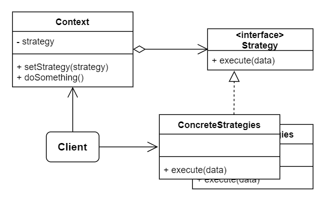

# No.20 Strategy
Lets you define a family of algorithms, put each of them into a separate class, and make their objects interchangeable.

## Structure
The structure of Strategy consists of 4 parts:
1. Context
  Maintains a reference to one of the concrete strategies and communicates with this object only via the strategy interface.
2. Strategy
  Declares a method the context uses to execute a strategy.
3. Concrete Strategies
  Implement different variations of an algorithm the context uses.
4. Client
  Creates a specific strategy object and passes it to the context. The context exposes a setter which lets clients replace the strategy associated with the context at runtime.

## When to Use
- Use different variants of an algorithm within an object and switch one to another at runtime.
- When you have a lot of similar classes that only differ in the way they execute some behavior.
- Isolate the business logic of a class from the implementation details of algorithms.

## How to Implement
1. In the context class, identify an algorithm that's prone to frequent changes.
2. Declare the strategy interface common to all variants of the algorithms.
3. Extract all algorithms into their own classes.
4. Add a field for storing a reference to a strategy object to the context class. Provide a setter for replacing values of that field.
5. Clients of the context must associate it with a suitable strategy that matches the way they expect the context to perform its primary job.

## Pros and Cons
Pros
- Swap algorithms used inside an object at runtime.
- Isolate the implementation details of an algorithm from the code that uses it.
- Replace inheritance with composition.
- Open / Closed Principle.
Cons
- Clients must be aware of the differences between strategies to be able to select a proper one.
- Functional type as parameters can solve this problem like Strategy pattern.

## Relations with Other Patterns
- Decorator lets you change the skin of an object, while Strategy lets you change the guts.
- State can be considered as an extension of Strategy.