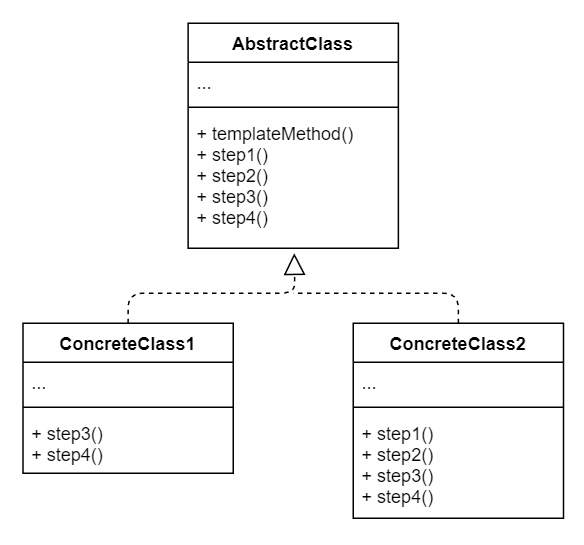

# No.21 Template
Defines the skeleton of an algorithm in the superclass but lets subclasses override specific steps of the algorithm without changing its structure.

## Structure
The structure of Template consists of 2 parts:
1. Abstract Class
  Declares methods that act steps of an algorithm, as well as the actual template method which calls these methods in a specific order. The steps may either be declared abstract or have some default implementation.
2. Concrete Classes
  Can override all of the steps, but not the template mathod itself.

## When to Use
- When you want to let clients extend only particular steps of an algorithm, but not the whole algorithm or its structure.
- Several classes that contain almost identical algorithms with some minor differences.

## Pros and Cons
Pros
- Let clients override only certain parts of a large algorithm.
- Pull the duplicate code into a super class.
Cons
- Some clients may be limited by the provided skeleton of an algorithm.
- Might violate the Liskov Substitution Principle by suppressing a default step implementation via a subclass.
- Template methods tend to be harder to maintain the more steps they have.

## Relations with Other Patterns
- Template is based on inheritance, Strategy is based on composition. Template works at the class level, it's static. Strategy works on the object level, letting you switch behaviors at runtime.