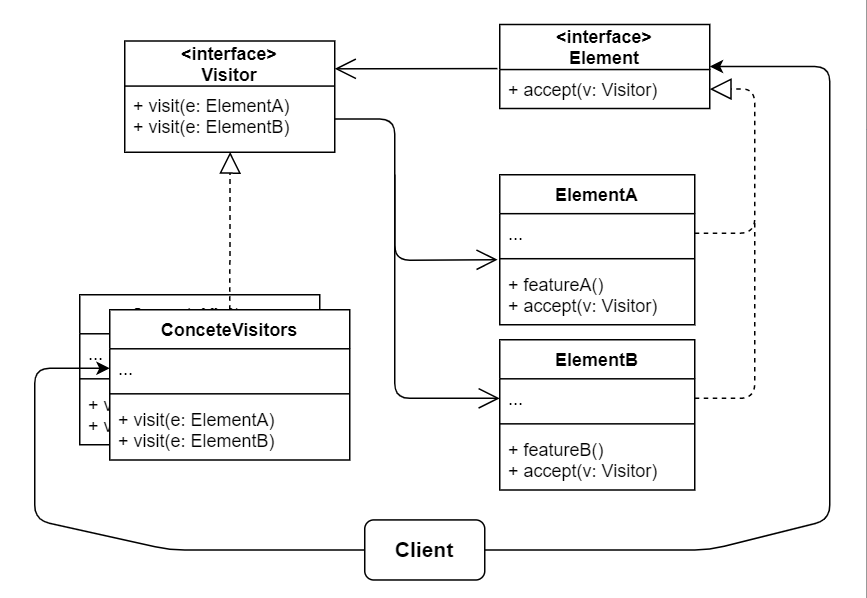

# No.22 Visitor
Lets you separate algorithms from the objects on which they operate.

## Structure
The structure of Visitor consists of 5 parts:
1. Visitor (interface)
  Declares a set of visiting methods that can take concrete elements of an object structure as arguments.
2. Concrete Visitor
  Implements several versions of the same behaviors, tailored for different concrete element classes.
3. Element (interface)
  Declares a method for "accepting" visitors. This method should have one parameter declared with the type of the visitor interface.
4. Concrete Element
  Must implement the acceptance method, aiming to redirect the call to the proper visitor's method corresponding  to the current element class.
5. Client
  Usually represents a collection or some other complex object. Usually, clients aren't aware of all the concrete element classes because they work with objects from that collection via some abstract interface.

## When to Use
- When you need to perform an operation on all elements of a complex object structure. (object tree)
- Use the Visitor to clean up the business logic of auxiliary behaviors.
- When a behavior makes sense only in some classes of a class hierarchy, but not in others.

## Pros and Cons
Pros
- Open / Closed Principle.
- Single Responsibility Principle.
- A visitor object can accumulate some useful information while working with various objects.
Cons
- You need to update all visitors each time a class gets added to or removed from the element hierarchy.
- Visitors might lack the necessary access to the private fields and methods of the elements that they're supposed to work with.

## Relations with Other Patterns
- You can treat Visitor as a powerful version of the Command pattern.
- Use Visitor to execute an operation over an entire Composite tree.
- Use Visitor along with Iterator to traverse a complex data structure and execute some operation over its elements, even if they all have different classes.