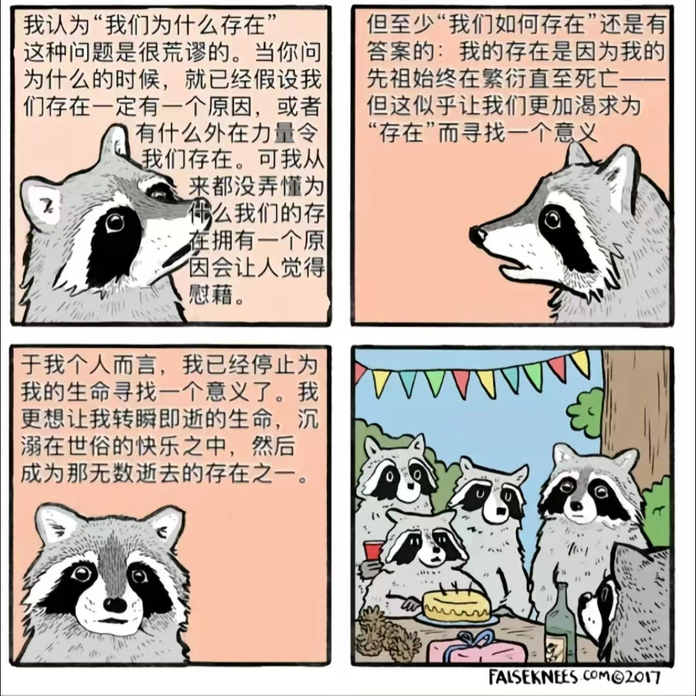

# 2022-12-24 16:21:15
The Factory Pattern is harder than I though, it took me about 2 hours to read this part and implement with Go, let alone the extensions such as Pros & Cons, Relation with other Patterns, Application details, etc. But it's quite interesting while using Go to implement my own design. In a way, design patterns is a little bit abstract, it takes a really long period and much development experience to fully understand and use them. Hope I can enjoy the process ~

# 2022-12-24 23:56:23
Difficult the first time, easy the second. Abstract Factory cost me about one hour and a half. I'm a little confused by the difference between Factory Method and Abstract Factory. It seems Abstract Factory is superset of Factory Method, it's a deeper abstraction of Factory & Products, which suits for more complicated business scenarios. The matrix of concrete products impressed me a lot, I wonder if Abstract Factory still works when the matrix includes several blank parts.

# 2022-12-26 15:35:50
My team leader is on leave tody, so I get a lot of time for reading and learning. Builder Pattern is really complex, both understanding and implementing. I think I'm getting fascinated by these fantastic methodology. The process of implementing them on my own is of great fun, hope every developer can feel this fun.

# 2022-12-27 00:10:06
I'm so excited that I made my test program panic! Easy, I've not gone crazy. It's the first time for me to take such a close look at goroutines and threads (in other words, CONCURRENCY) during six months' work experience. At the beginning I just wanna init dbConn several times to prove my 'getInstance()' func is idempotent, then after so many panics I realized that the main program stream won't wait for every 'go func' finishes. So I added sync.Waitgroup to control the sequence of the program. However, my unit test still gone panic. I tried my best to figure out why, but I failed. So I decided to ask my dear team leader tomorrow and keep this mistake as a negative example to remind me of concurrency problems forever ~

# 2022-12-27 17:45:32
Finally I solve the panic of Singleton test with the 'help' of my team leader. The logic of my codes proved correct, while the 'Lock' I used was 'sync.Lock', which is just an interface opened for developers to implement on demand :). And I also learned that 'sync.Once' has already encapsulated all the things I need to do while using Singleton. Whatever, the learning of creational patterns has come to an end temporarily, maybe I'll take an overall review together with structural patterns this weekends. 

# 2022-12-28 23:36:25
Before I intended to finish the study of design pattern before New Year's Day, though I learn at least one pattern a day, it seems this goal won't be achieved on schedule. Honestly speaking, I benefit a lot from the learning process. The ideas of these 23 patterns are very powerful, I wonder who and how initially discovered and summarized them. Also, my written English improves progressively, though I always look up words with google translation. The only thing that frustrates me is that I rarely find the right people to share the joy of learning new things. Maybe that's why I made this 'broken thoughts' part, not only record my learning progress, but also find a hidden corner to say something from the heart.

# 2022-12-30 01:00:25
It's really difficult to insist on studying every day. I always like to reward myself a glass of alcohol after one night's learning, sometimes beer, sometimes whisky. I suppose I still enjoy the process even I sacrificed my agreeable night time for fun. This New Year's vacation I'm gonna to travel around DaLian, spend the last minute besides the sea drinking and laughing with my good friends in college. Sounds great, right? After more than half a year's work, I think I love coding as a developer, really. Leaving aside all the tedious tasks, I wholeheartly enjoy the process of creating. Eyes on the editor, soul around the world. I only live once, there's still so many things I've never seen, so many emotions I've never felt, and so many ways of different lives I've never walked on. I saw a four figure cartoon yesterday and felt a deep emotional resonance in it. Maybe I'm not as free and easy as the raccon in the cartoon, I still carry with the doubts of the meaning of human existence, but it doesn't prevent me from enjoying the vulgar happiness of living in the world as an insignificant human being. I'm proud of everything I've achieved today, and I'll move on, searching and searching until the end.

## 2023-01-03 23:55:18
After a 3-day journey at DaLian, I think I figured out many things which haunted in my mind these days. I cherish connections with my friends and family, I enjoy experiencing this wonderful world, I long to explore philosophy and literature. Maybe these are the reasons I live. I know this may change over time, but I'm absolutely sure about this at this particular moment, that's enough. 