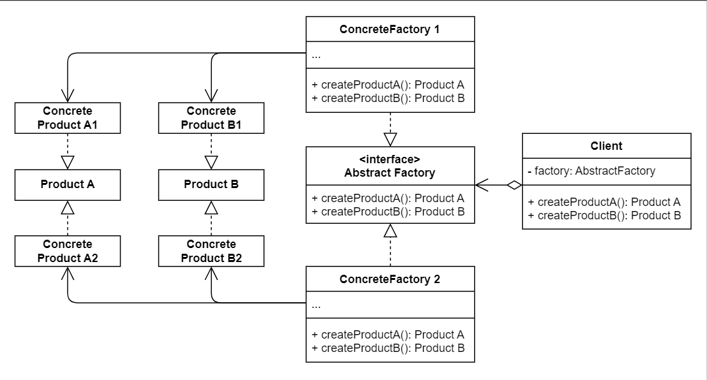

# No.2 Abstract Factory

## Structure
The Structure of Abstract Factory consists of 5 parts:
1. Abstract Products
  Declare interfaces for a set of distinct but related products which make up a product family.
2. Concrete Products
  Various implementations of abstract products, grouped by variants.Each abstract product must be implemented in all given variants.
3. Abstract Factroy
  Declare a set of methods for creating abstract products.
4. Concrete Factories
  Implement creation methods of the abstract factory.
5. Client
  Work with any concrete factory / product variant, as long as it communicates with their objects via abstract interfaces.

## When to Use
- A class have a set of factory methods that blur its primary responsibility.
- A class deal with too many type of products.

## How to Implement
1. Map out a matrix of distinct product types versus variants of these products.
2. Declare abstract product interfaces. Make concrete product classes to implement these interfaces.
3. Declare abstract factory interfaces with a set of creation methods for all abstract products.
4. Implement a set of concrete factory classes, one for each product variant.
5. Create factory initialization func in the app, instantiate one concrete factory (depending on the app config or current env) and pass this object to all classes that construct products. 
6. Replace all product constructors with appropriate creation method on the factory method.

## Pros and Cons
Pros
- Avoid tight coupling between concrete products and client code.
- Single Responsibility Principle.
- Open / Closed Principle.
Cons
- Code becomes more complicated.

## Relations with Other Patterns
- Abstract Factory specialized in creating families of related objects.
- Based on a set of Factory Methods.