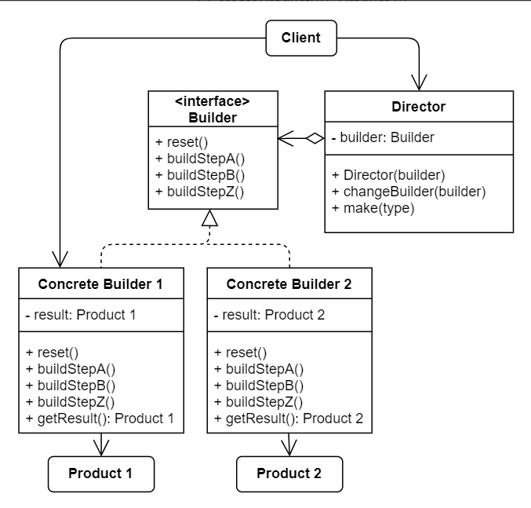

# No.3 Builder
Builder organizes object construction into a set of steps. To create an object, you execute a series of these steps on a builder object.

## Structure
The structure of Builder consists of 5 parts:
1. Builder
  Interface, declares product construction steps that are common to all types of builders.
2. Concrete Builders
  Provide different implementations of the construction steps.
3. Products
  Resulting objects, constructed by different builders. They don't have to belong to the same class hierarchy or interface.
4. Director
  Defines the order of construction steps.
5. Client
  Must associate one of the builder objects with the director.

## When to Use
Using the Builder pattern makes sense only when your products are quite complex and require extensive configurations.
- Get rid of a "telescopic constructor".
- To create different representations of some product.
- Construct Composite trees or other complex objects.

## How to Implement
1. Clearly define the common construction steps for building all products.
2. Declare these steps in the base builder interface.
3. Create a concrete builder for each kind of products and implement construction steps.
  (fetching the result of a consttuction shouldn't be declared in the abstract builder interface, cuz various builders may return different type of products)
4. Create a director class to encapsulate various ways to construct a product using the same builder class.
5. Client code creates both the builder and the director objects.
6. The construction result can be obtained directly from the director only if all products follow the same interface. Otherwise, the client should fetch the results from the builder.

## Pros and Cons
Pros
- Construct objects step-by=step, defer construction steps or run steps recursively.
- Reuse the same construction code when building different products.
- Single Resposibility Principle.
Cons
- Overall complexity of the code increases.

## Relations with Other Patterns
- Builder focuses on constructing complex objects step by step; Abstract Factory specilaizes in creating families of related objects.
