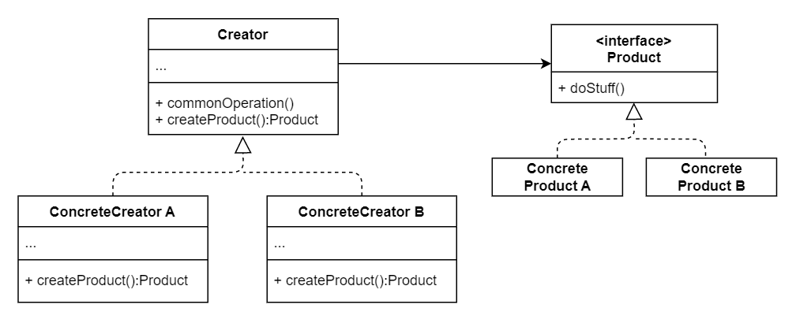

# No.1 Factory
Factory Method provides an interface for creating objects in a superclass, but allows subclasses to alter the type of objects that will be created.

## Structure 
The structure of Factory Method consists of 4 parts:
1. Product 
  Declare the interface, what can be produced and what these products do.
2. Concrete Product
  Different implementation of product.
3. Creator
  Declare factory method, return type must match the product interface.
4. Concrete Creator
  Override the base factory method to return different types of product.

## When to Use
- Use when you don't know beforehand the exact type and dependencies of the objects your code should work with.
- Use when you want to provide users of your library or framework with a way to extend its internal components.
- Use when you want to save system resources by reusing existing objects instead of rebuilding them each time.

## How to Implement
1. Make all products follow the same interface.
2. Add an empty factory method inside the creator calss. Return type should match the common product interface.
3. In the creator's code find all references to product constructors.

## Pros and Cons
Pros
- Avoid tight coupling between the creator and the concrete products.
- Single Resposibility Principle.
- Open / Closed Principle.
Cons
- Introduce a lot of new subclasses to implement the pattern.

## Relations with Other Patterns
- Evolve toward Abstract Factory, Prototype, or Builder.