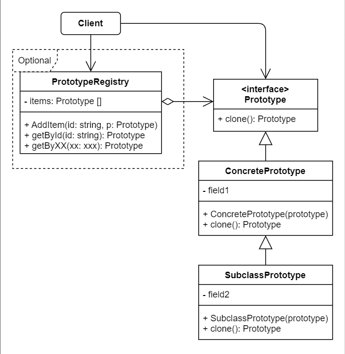

# No.4 Prototype (Clone)
The prototype pattern delegates the cloning process to the actual objects that are being cloned.

## Structure
The structure of prototype consists of 4 parts:
1. Prototype
  Interface, declares the cloning methods. Mostly it's a single clone method.
2. Concrete Prototype
  Implement the cloning method.
3. Client
  Produce a copy of any object that follows the prototype interface.
4. Prototype Registry (Optional)
  Provide an easy way to access frequently-used prototypes. It stores a set of pre-built objects that are ready to be copied.

## When to Use
- Use Prototype when your code shouldn't depend on the concrete classes of objects that you need to copy.
- Instead of instantiating a subclass that matches some configuration, the client can simply look for an appropriate one and clone it.

## How to Implement
1. Declare the prototype interface and clone method.
2. A prototype class must define the alternative constructor that accepts an object of that class as an argument.
3. The cloning method usually consists of just one line: running a new operation with the prototypical version of the constructor.
4. Optionally, create a centralized prototype registry to store a catalog of frequently used prototypes. (You can implement this with Factory Method).

## Pros & Cons
Pros
- Clone objects without coupling to their concrete classes.
- Produce complex objects more conveniently.
- Get an alternative to inheritance when dealing with configuration presets for complex objects.
Cons
- Cloning complex objects that have circular references might be very tricky.

## Relations with Other Patterns
- Prototype isn't based on inheritance, so it doesn't have its drawbacks; while Factory Method is, but doesn't require an initialization step.
