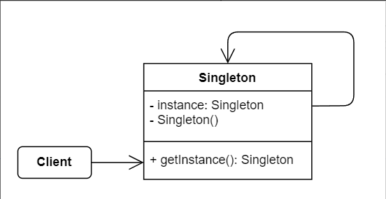

# No.5 Singleton
Lets you ensure that a class has only one instance, while providing a global access point to this instance.

## Structure
Only One.
1. Singleton Class
  Declares the static method getInstance that returns the same instance of its own class.

## When to Use
- Use the Singleton pattern when a class in your program should have just a single instance available to all clients.
- Use when you need stricker control over global variables.

## How to Implement
1. Add a private static field to the class for storing the singleton instance.
2. Declare a public static creation method for getting the singleton instance.
3. Implement 'lazy initialization' inside the static method. (After first init, the creation method should be idempotent)
4. Make the constructor of the class private.

## Pros and Cons
Pros
- Be sure a class has only one instance.
- Global access point to that instance.
Cons
- Violate the Single Responsibility Principle. The pattern solves two problems(Pros) at the time.
- Mask bad design.
- Require special treatment in a multithreaded environment so that multiple threads won't create a singleton object several times.
- It may be difficult to unit test the client code of the Singleton because many test frameworks rely on inheritance when producing mock objects.

## Relations with Other Patterns
- Abstract Factories, Builders and Prototypes can all be implemented as Singleton.