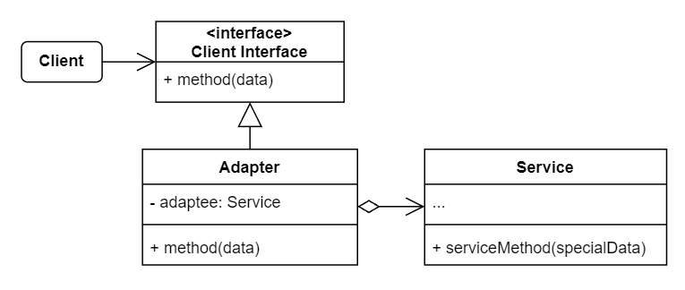
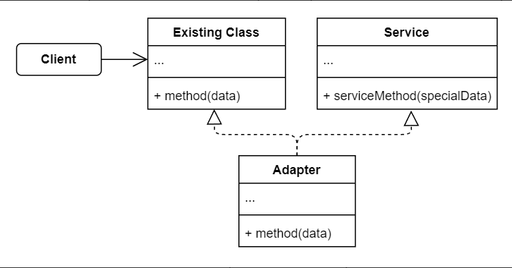

# No.6 Adapter (Wrapper)
Adapter allows objects with incompatible interfaces to collaborate.

## Structure
The structure of adapter consists of 4 parts:
1. Client
  Contains the exsiting business logic.
2. Client Interface
  Describes a protocol that other classes must follow to be able to collaborate with the client.
3. Service
  Usually 3rd-party or legacy.
4. Adapter
  Able to work with both the client and the service. Implements client interface, while wrapping the service object.

**Another implementation: Class Adapter**
- This implementation uses inheritance: the adapter inherits interfaces from both objects at the same time.
- This approach can only be implemented in programming languages that support multiple inheritance.

Class Adapter doesn't need to wrap any objects because it inherits behaviors from both the client and the service. The adaptation happens within the overriddien methods. The resulting adapter can be used in place of an existing client class.

