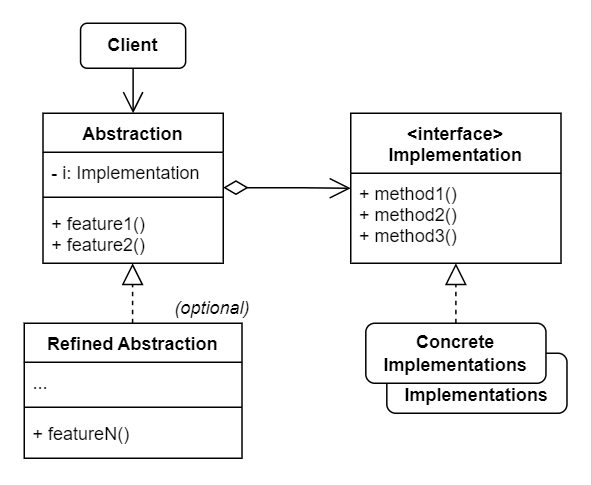

# No.7 Bridge
Split a large class or a set of closely related classes into two separate hierarchies - abstraction and implementation which can be developed independently.

## Structure
The structure of Bridge consists of 5 parts:
1. Abstraction
  Provides high-level control logic. It relies on the implementation object to do the actual low-level work.
2. Implementation
  Declares the interface that's common for all concrete implementations.
3. Concrete Implementations
  Contain platform-specific code.
4. Refined Abstractions
  Provide variants of control logic. Work with differnt implementations via the general implementation interface.
5. Client
  Only interested in working with the abstraction. However, it's the client's job to link the abstraction object with one of the implementation objects.

## When to Use
- Divide and organize a monolithic class that has several variants of some functionality.
- Extend a class in several orthogonal (independent) dimensions.
- Switch implementations at runtime.

## How to Implement
1. Identify the orthogonal dimensions in your classes.
2. See what operations the client needs and define them in the base abstraction class.
3. Determine the operations available on all dimensions.
4. Implement the general implementation interface in all dimensions.
5. Inside the abstraction class, add a reference field for the implementation type.
6. If you have several variants of high-level logic, create refined abstractions by extending the base abstraction class.
7. The client should pass an concrete implementation object to the abstraction's constructor, then the client can forget about the implementation and work only with the abstraction object.

## Pros and Cons
Pros
- Create platform-independent classes and types.
- Client code works with high-level abstractions instead of being exposed to the platform details.
- Open / Closed Principle.
- Single Responsibility Principle.
Cons
- Code becomes more complicated by applying the pattern to a highly cohesive class.

## Relations with Other Patterns
- Bridge usually designed up-front, while Adapter commonly used tiwh an existing app.
- Bridge, State, Strategy are all based on composition.
- Use Bridge with Abstract Factory together to encapsulate these relations.
- Combine Builder with Bridge: director plays the role of the abstraction, different builders act as implementations.