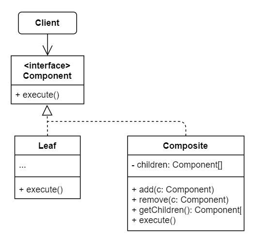

# No.8 Composite (Object Tree)
Lets you compose objects into tree structures and then work with these structures as if they were individual objects.

## Structure
The structure of Composite consists of 4 parts:
1. Component (interface)
  Describes operation that are common to both simple and complex elements of the tree.
2. Leaf
  Basic element of a tree, do most of the real work.
3. Container (Composite)
  Element that has sub-elements. Delegate works to sub-elements.
4. Client
  Works with all elements through the component interface. Same way with both simple or complex elements of the tree.

## When to Use
- When you have to Implement a tree-like object structure.
- When you want the client code to treat both simple and complex elements uniformly.

## How to Implement
1. Make sure that the core model of your app can be represented as a tree structure.
2. Declare the component interface with a list of methods that make sense for both simple and complex components.
3. Create leaf & container classes. Make sure the container class provide an array field for storing references to subelements.(suitable for both leaf & compound classes)
4. Define the methods for adding and removal of child elements in the container.(can also be declared in the component interface, though this violates the Interface Segregation Principle cuz the methods will be empty in the leaf class)

## Pros and Cons
Pros
- Work with complex tree structures more conveniently.(using polymorphism and recursion)
- Open / Closed Principle.
Cons
- It might be difficult to provide a common interface for classes whose functionality differs too much.

## Relations with Other Patterns
- Use Builder when creating complex Composite trees.(recursively)
- Chain of Resonsibility is often used in conjunction with Composite.
- You can use Iterators to traverse Composite trees.
- You can use Visitor to execute an operation over an entire Composite tree.
- Implement shared leaf nodes of the Composite tree as Flyweights to save some RAM.
- Composite & Decorator both rely on recursive composition. Decorator only has one child and adds additional responsibilities to the wrapped object, while Composite just 'sums up' its children results.
