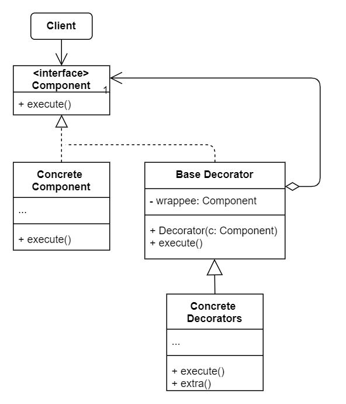

# No.9 Decorator (Wrapper)
Lets you attach new behaviors to objects by placing these objects inside special wrapper objects that contain the behaviors.

## Structure
The structure of Decorator consists of 5 parts:
1. Component (interface)
  Declares the common interface for both wrappers and wrapped objects.
2. Concrete Component
  A class of objects being wrapped, defines basic behaviors which can be altered by decorators.
3. Base Decorator
  Has a field for referencing a wrapped object (declared as the component interface).
4. Concrete Decorator
  Define extra behaviors that can be added to components dynamically.
5. Client
  Wrap components in multiple layers of decorators, as long as it works with all objects via the component interface.

## When to Use
- Assign extra behaviors to objects at runtime without breaking the code that uses these objects.
- If it's awkward or impossible to extend an object's behavior using inheritance.

## How to Implement
1. Make sure your business domain can be represented as a primary component with multiple optional layers over it.
2. Figure out common methods of both the primary component and optional layers. Create a component interface.
3. Create a concrete component class and define the base behavior in it.
4. Create a base decorator class, with a field for storing reference to a wrapped object. The field should be declared with the component interface type to allow linking to concrete components as well as decorators.
5. Make sure all classes implement the component interface.
6. Create concrete decorators by extending them from the base decorator. Concrete decorators must execute its behavior before or after the call to the parent method.
7. The client code must be responsible for creating decorators and composing them in the way the client needs.

## Pros and Cons
Pros
- Extend an object's behavior without making a new subclass.
- Add or remove responsibilities from an object at runtime.
- Combine several behaviors by wrapping an object into mutiple decorators.
- Single Responsibility Principle.
Cons
- Hard to remove a specific wrapper from the wrappers stack.
- The initial configuration code of layers might look pretty ugly.

## Relations with Other Patterns
- Adapter changes the interface of an existing object, while Decorator enhances an object without changing its interface. Also, Decorator supports recursive composition.
- CoR and Decorator are very similar. But CoR can execute arbitrary operations independently of each other and stop passing the request further at any point. Decorators aren't allowed to break the flow of the request.
- Decorator lets you change the skin of an object, while Strategy lets you change the guts.