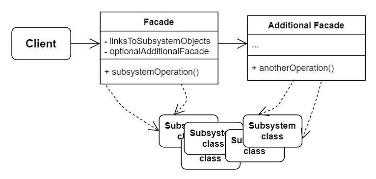

# No.10 Facade
Provides a simplified interface to a library, a framework, or any other complex set of classes.

## Structure
The structure of Facade consists of 4 parts:
1. Facade
  Provides convenient access to a particular part of the subsystem's functionality.
2. Additional Facade
  Used to uncoupling facades, can be used both by clients and other facades.
3. Complex Subsystem
  Subsystem classes aren't aware of the facade's existence.
4. Client
  Uses the facade instead of calling the subsystem objects directly.

## When to Use
- Provide a shortcut to the most-used features of the subsystem which fit most client requirements.
- Structure a subsystem into layers.

## How to Implement
1. Check whether it's possible to provide a simpler interface from the subsystem. Client code should be independent from many of the subsystem's classes.
2. Declare and implement this interface in a new facade class.
3. Make all the client code communicate with the subsystem only via the facade.
4. If the facade becomes too big, consider extracting part of its behavior to a new, refined facade class.

## Pros and Cons
Pros
- Isolate your code from the complexity of a subsystem.
Cons
- A facade can become a god object coupled to all classes of an app.

## Relations with Other Patterns
- Facade defines a new interface for existing objects, whereas Adapter tries to make the existing interface usable.
- Facade class can ofen be transformed into a Singleton since a single facade object is sufficient in most cases.