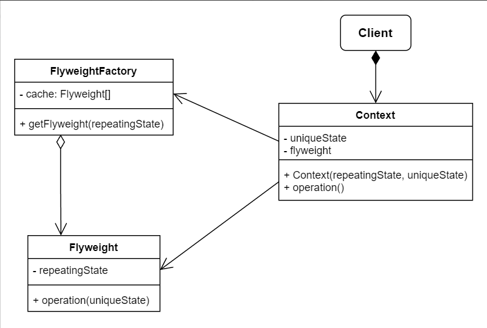

# No.11 Flyweight (Cache)
Lets you fit more objects into the available amount of RAM by sharing common parts of state between multiple objects instead of keeping all of the data in each object.

The Flyweight pattern is merely an optimization. Before applying it, make sure your program does have the RAM consumption problem related to having a massive number of similar objects in memory at the same time. Make sure that this problem can't be solved in any other meaningful way.

## Structure
The structure of Flyweight consists of 4 parts:
1. Flyweight
  Contains the portion of the original object's state that can be shared between multiple objects.(intrinsic state)
2. Context
  Contains the extrinsic state, unique across all original objects. Paired with one of the flyweight objects to represents the full state of the original object.
3. Client
  Calculates or stores the extrinsic state of flyweights. From the client's perspective, a flyweight is a template object which can be configured at runtime by passing some contextual data into parameters of its methods.
4. Flyweight Factory
  Manages a pool of existing flyweights. Client passes factory bits of the intrinsic state of the desired flyweight to create one. Factory looks over previously created ones and either returns an existing one or create a new one. 

## When to Use
The benefit of applying the pattern depends heavily on how and where it's used. Most useful when:
- An application needs to spawn a huge number of similar objects.
- Lack of RAM.
- The objects contain duplicate states which can be extracted and shared between multiple objects.

## How to Implement
1. Divide fields of a class that will become a flyweighe into intrinsic and extrinsic states.
2. Leave the fields representing the intrinsic state in the class, make sure they're immutable, initialized only inside the constructor.
3. For each field (extrinsic state) used in class method, introduce a new parameter and use it instead of the field.
4. Optionally, create a factory class to manage the pool of flyweights (with cache). Clients only request flyweights throuth it, and describe desired flyweight by passing its instrinsic state to the factory.
5. The client must store or calculate values of the extrinsic state (context) to be able to call methods of flyweight objects. Conveniently, you can move extrinsic state along with the flyweight-referencing field to a seperate context class.

## Pros and Cons
Pros
- Save lots of RAM.
Cons
- Trading RAM over CPU.
- Codes becomes much more complicated.

## Relations with Other Patterns
- Shared leaf nodes of Composite trees is one type of Flyweights.
- Flyweight shows how to make lots of little objects; whereas Facade shows how to make a single object that represents an entire subsystem.
- Flyweight vs Singleton:
  1. Only one Singleton instance, multiple Flyweight instances with different intrinsic state.
  2. Singleton object can be mutable, Flyweight objects are immutable. 