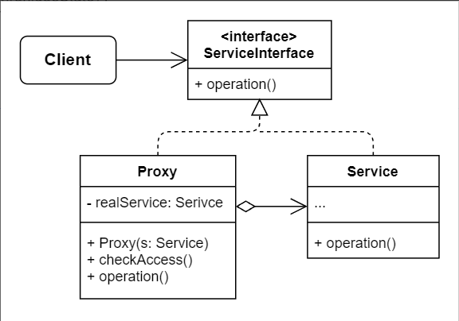

# No.12 Proxy
Provides a substitute or placeholder for another object. A proxy controls access to the original object, allowing you to perform something either before or after the request gets through to the original object.

## Structure
The structure of Proxy consists of 4 parts:
1. Service Interface
  Declares the interface of the service. The proxy must follow this interface to be able to disguise itself as a service object.
2. Serivce
  A class that provides some useful business logic.
3. Proxy
  Has a reference field that points to a service object. After the proxy finishes its processing, it passes the request to the serivce object. Usually manages the full lifecycle of their service objects.
4. Client
  Work with both services and proxies via the same interface.

## When to Use
- Lazy initialization (virtual proxy).
- Access control (protection proxy).
- Local execution of a remote service (remote proxy).
- Logging requests (logging proxy).
- Caching request results (caching proxy).
- Smart reference (Nginx).

## How to Implement
1. Create one service interface to make proxy and service objects interchangeable.
2. Create the proxy class. It should have a field for storing a reference to the service.
3. Implement the proxy methods according to their purpose. Proxy delegates the work to service object.
4. Consider introducing a creation method that decides whether the client gets a proxy or a real service.
5. Consider implementing lazy initialization for the service object.

## Pros and Cons
Pros
- Control the service object without clients knowing about it.
- Manage the lifecycle of the service object when clients don't care about it.
- The proxy works even if the service object isn't ready or is not available.
- Open / Closed Principle.
Cons
- Code complexity increases.
- The response from the service might get delayed.

## Relations with Other Patterns
- **Adapter**: different interface; **Proxy**: same interface; **Decorator**: enhanced interface.
- Facade & Proxy both buffer a complex entity and init it on its own. But Proxy has the same interface as its service object, which makes them interchangeable.
- Decorator & Proxy have similar structures based on composition, but different intents. In both patterns, object delegate work to another, Proxy usually manages the lifecycle of the service object on its own, whereas the composition of Decorators is always controlled by the client.